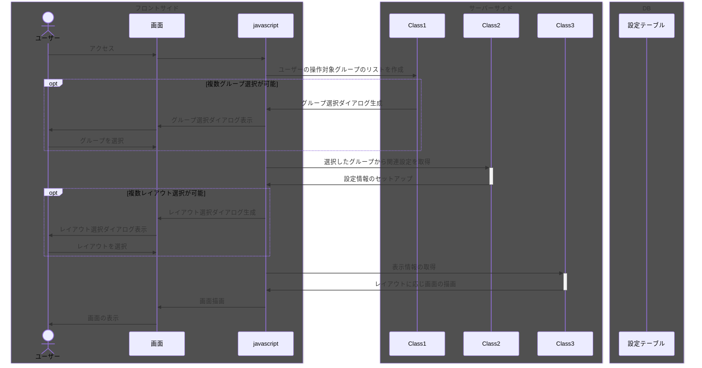

```mermaid
sequenceDiagram

box rgba(80, 80, 80, 1) フロントサイド
    actor user as ユーザー
    participant screen as 画面
    participant js as javascript
end
box rgba(80, 80, 80, 1) サーバーサイド
    participant class1 as Class1
    participant class2 as Class2
    participant class3 as Class3
end
box rgba(80, 80, 80, 1) DB
    participant table as 設定テーブル
end

user ->> screen : アクセス
%% 選択可能なグループを選択
screen ->> js : 
js ->> class1 : ユーザーの操作対象グループのリストを作成
opt 複数グループ選択が可能
    class1 ->> js : グループ選択ダイアログ生成
    js ->> screen : グループ選択ダイアログ表示
    screen ->> user : 
    user ->> screen : グループを選択
end

js ->>+ class2 : 選択したグループから関連設定を取得
class2 ->>- js : 設定情報のセットアップ

%% レイアウトの選択
opt 複数レイアウト選択が可能
    js ->> screen : レイアウト選択ダイアログ生成
    screen ->> user : レイアウト選択ダイアログ表示
    user ->> screen : レイアウトを選択
end

%% 表示情報の取得・描画
js ->>+ class3 : 表示情報の取得
class3 ->>- js : レイアウトに応じ画面の描画
js ->> screen : 画面描画
screen ->> user : 画面の表示
```
